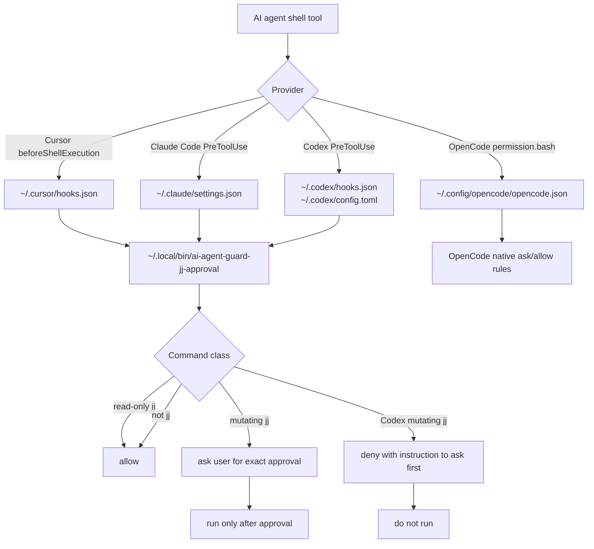

# AI Agent Jujutsu Approval

AI agents must ask before running mutating Jujutsu commands. Human shell usage is unchanged: this is not a `jj` wrapper and does not intercept manual commands.

Agent-specific guard code, hook templates, and tests live under `AI/`. OpenCode uses its normal dotfile config at `.config/opencode/opencode.json` because that file is settings/config and is not interpreted merely by opening this repository.

## What Is Protected

Read-only inspection is allowed without prompting: `jj status`, `jj diff`, `jj log`, `jj show`, `jj op log`, `jj config list`, and equivalent local aliases.

Everything that can commit, move the working copy, rewrite history, change bookmarks, abandon work, undo, or push requires approval. Examples: `jj commit`, `jj new`, `jj edit`, `jj next`, `jj prev`, `jj rebase`, `jj squash`, `jj absorb`, `jj abandon`, `jj undo`, `jj bookmark set`, and `jj git push`.

## Architecture



## Files

| Path                                  | Role                                                        |
|---------------------------------------|-------------------------------------------------------------|
| `AI/agent-guards/jj-approval`         | Shared classifier and provider response adapter             |
| `AI/agent-guards/install`             | Idempotently installs/merges active user-level agent config |
| `Setup/installers/ai-agents.sh`       | `run.sh` AI-agent setup step; also handles user-global AI tooling |
| `AI/cursor/rules/jj-ai-approval.mdc`  | Cursor instruction rule source                              |
| `AI/cursor/hooks.json`                | Versioned Cursor hook template                              |
| `.config/opencode/opencode.json`      | OpenCode permission defaults                                |
| `AI/tests/test_jj_approval_guard.py`  | Guard behavior tests                                        |

## Provider Behavior

Cursor and Claude Code can ask the user from pre-execution hooks, so mutating `jj` commands become approval prompts.

Codex hooks currently support denial in `PreToolUse`, but not interactive `ask`. The guard therefore denies mutating `jj` commands and tells the agent to request express approval before trying again.

OpenCode uses native `permission.bash` rules: `jj *` asks by default, with explicit allow rules for read-only `jj` commands.

## Installation

Run the normal dotfiles installer:

```sh
./run.sh
```

The installer calls `AI/agent-guards/install`, which creates the `~/.local/bin/ai-agent-guard-jj-approval` symlink and merges provider config without overwriting unrelated settings.

Manual re-run:

```sh
AI/agent-guards/install
```

## Verification

```sh
python3 AI/tests/test_jj_approval_guard.py
```

Expected result: read-only `jj` commands allow; mutating `jj` commands ask for Cursor/Claude, deny for Codex, and non-`jj` commands allow.
