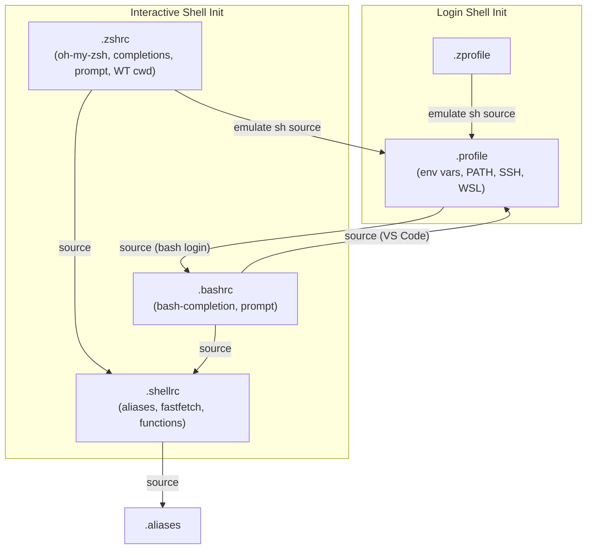

# Linux Setup <!-- omit from toc -->

1. [Prerequisites](#prerequisites)
2. [Installation](#installation)
3. [Shell configuration](#shell-configuration)
4. [Tool managers](#tool-managers)
	1. [mise](#mise)
		1. [Installing directly from repos](#installing-directly-from-repos)
	2. [Homebrew](#homebrew)
	3. [Built-in package managers](#built-in-package-managers)
5. [AI agent safety](#ai-agent-safety)
6. [GPG, commit signing and authentication (deprecated)](#gpg-commit-signing-and-authentication-deprecated)
	1. [Importing keys](#importing-keys)
	2. [SSH authentication with GPG](#ssh-authentication-with-gpg)
	3. [WSL setup](#wsl-setup)
	4. [Use TUI pinentry](#use-tui-pinentry)
7. [WSL](#wsl)
	1. [Detecting WSL inside shell scripts](#detecting-wsl-inside-shell-scripts)

# Prerequisites

- The private GPG key as an `.asc` file
- Git configured with the basics to download the repo. If needed, check [#GPG and commit signing](#gpg-and-commit-signing).
- VS Code or Cursor installed.

---

# Installation

Setup is managed by Nix (Home Manager). On a fresh machine, run the distro-specific bootstrap, which installs prerequisites, clones this repo, and hands off to the Nix setup:

- Arch (incl. WSL): [`Arch/run_arch.sh`](Arch/run_arch.sh)
- Ubuntu (incl. WSL): [`Ubuntu/run_ubuntu.sh`](Ubuntu/run_ubuntu.sh)

On a machine that already has the repo cloned, run the Nix bootstrap directly:

```sh
bash ~/dotfiles/nix/bootstrap.sh   # auto-detects arch vs arch-wsl; override with HOST=<arch|arch-wsl|ubuntu|macbook>
```

See [`nix/README.md`](nix/README.md) for how it's structured and [`Documentation/Nix_exploration.md`](Documentation/Nix_exploration.md) for the full design and tool-ownership split.

---

# Shell configuration

Shell config is layered so that non-interactive env setup is separated from interactive config, and agent sessions (Cursor, Claude Code, OpenCode) stay barebones.



| File       | Purpose                                                          |
|------------|------------------------------------------------------------------|
| `.profile` | Non-interactive env: XDG dirs, PATH, SSH, WSL, secrets           |
| `.shellrc` | Common interactive config: aliases, fastfetch, utility functions |
| `.zshrc`   | Zsh-specific: oh-my-zsh, completions, prompt, tmux               |
| `.bashrc`  | Bash-specific: bash-completion, prompt                           |
| `.aliases` | Shell-agnostic aliases (sourced by `.shellrc`)                   |

Agent sessions get only `.profile` + tool activation (direnv, mise) -- no aliases, completions, prompt, or tmux. Windows Terminal sessions use native tab restoration; tmux is opt-in via `DOTFILES_AUTO_TMUX=1`.

---

# Tool managers

## [mise](https://mise.jdx.dev/)

Recommended since you can manage multiple language SDKs + tools at once, not needing a version manager for each.

It also works directly with GitHub repos, [asdf plugins](https://github.com/asdf-vm/asdf-plugins), and a bunch of [other backends (aqua, vfox, etc)](https://mise.jdx.dev/dev-tools/backends/), so you can manage pretty much anything with it. Pretty neat!

The biggest drawback is that they won't be available until you activate mise for the given shell during initialisation,
unless you reference them manually. Generally speaking, some tools will require using the built-in package manager or
Homebrew. All that don't, however, probably wise to install with mise.

<details>
	<summary>
		<h3>Node + pnpm</h3>
	</summary>

Use `npm` to install `pnpm` because otherwise the cache and installed modules are lost every time `pnpm` is updated.

```sh
npx pnpm i -g pnpm # To save pnpm to $PNPM_HOME so cache won't be lost on updates
```

Optional extras:

* [ni](https://github.com/antfu/ni)
`pnpm i -g @antfu/ni`
* [taze](https://github.com/antfu-collective/taze)
`npm i -g taze` - pnpm doesn't *need* it but it's still useful
* [ncu](https://www.npmjs.com/package/npm-check-updates)
`npm i -g npm-check-updates` - pnpm doesn't need it. Taze is better, but always nice to have an alternative.

</details>

<details>
	<summary>
		<h3>Go</h3>
	</summary>

```sh
mise use -g go@latest golangci-lint@latest
```
</details>

<details>
	<summary>
		<h3>Python</h3>
	</summary>

```sh
# Only use this if `mise use -g python@latest` fails to install due to pkg-config issues
brew unlink pkg-config && \
CFLAGS="-I$(brew --prefix openssl)/include" \
LDFLAGS="-L$(brew --prefix openssl)/lib" \
mise use -g python@latest; \
brew link pkg-config
```
</details>

### Installing directly from repos

If a tool is not directly available in mise, you can install it from its GitHub repo.

The easiest way is to add the `org_or_user/repo` slug to the `~/.config/mise/config.toml` file in the `[alias]` section.

```toml
[alias]
"tldr++" = "ubi:isacikgoz/tldr"
```

and then run `mise use <alias>` to install it.

This is better than using `mise use -g ubi:<org_or_user>/<repo>` because the name won't be polluted with the `ubi:` prefix.
## Homebrew

The CLI toolbox is primarily managed by Nix ([`nix/home/packages.nix`](nix/home/packages.nix)); Homebrew manages exceptions from the repository [`Brewfile`](Brewfile), including Engram and httpstat. Opt in to installing Homebrew via `INSTALL_BREW=1` when running `nix/bootstrap.sh`; macOS GUI casks remain declared via nix-darwin. See [`Documentation/Nix_exploration.md`](Documentation/Nix_exploration.md#9-tool-ownership--retiring-runsh).

## Built-in package managers

When the tools must be available at all points during the startup process (even if something fails) and we don't care much about pinning a version.

---

# AI agent safety

A mechanism to get AI agents to ask before mutating Jujutsu state. The guard is implemented through provider hooks/permissions.

See [`Documentation/AI_agent_jj_approval.md`](Documentation/AI_agent_jj_approval.md) for more information.

---

# GPG, commit signing and authentication (deprecated)

> [!NOTE]
> I have migrated to using SSH keys exclusively for this purpose. It's just easier. This is here for future reference

GPG uses a main key that can have multiple subkeys with different purposes (Signing (SC), Encryption (E), and/or Authentication (A)).

Once created, a subkey cannot be modified.

## Importing keys

```sh
gpg --import <path/to/secret_key.asc>
gpg -K --keyid-format=long # Verify it was imported correctly
gpg --edit-key <email>
# Inside gpg
trust
# 5 = ultimate trust
5
# Save and quit
y
# Exit gpg
quit
```

## SSH authentication with GPG

To use your GPG key for SSH authentication, add the authentication subkey's keygrip to `~/.gnupg/sshcontrol`:

```sh
# List keys and find the [A] or [SEA] subkey's keygrip
gpg --list-keys --with-keygrip boscodomingob@gmail.com # Or use the key id

# Add the auth subkey keygrip to sshcontrol
echo "<auth-subkey-keygrip>" >> ~/.gnupg/sshcontrol

# Export SSH public key and add to GitHub/services
export SSH_AUTH_SOCK=$(gpgconf --list-dirs agent-ssh-socket)
ssh-add -L

# Restart agent to apply changes
gpgconf --kill gpg-agent
gpgconf --launch gpg-agent
```

Note that this is not necessary. You can always generate SSH keys on each device and add those to GitHub

It is however likely more convenient. Do whatever you prefer!

```sh
ssh-keygen -t ed25519 -C "boscodomingob@gmail.com"
```
and add the public key to GitHub/services.

```sh
cat ~/.ssh/id_ed25519.pub
```

## WSL setup

> Note that you *don't* need GPG4Win, you can use everything from Linux itself.
> However, GPG4Win can be useful if you ever plan on using Windows directly to develop or sign anything.

> Also, note thatkeys can only be cached for as long as the agent is running.
> Rebooting the machine will clear the cache.

Follow any of these guides:

* [39Signals](https://www.39digits.com/signed-git-commits-on-wsl2-using-visual-studio-code)
* [The Miners](https://blog.codeminer42.com/securing-git-commits-on-windows-10-and-wsl2/)
* [nathanv@blog](https://blog.nathanv.me/posts/gpg-windows/)
* [Ryan Emerle - importing Linux keys to Windows](https://emerle.dev/2020/08/21/git-signed-commits-in-windows-and-wsl/)

You may need to fix issues:

- [`gpg: WARNING: unsafe permissions on homedir '/home/path/to/user/.gnupg'`](https://gist.github.com/oseme-techguy/bae2e309c084d93b75a9b25f49718f85)
- [`gpg: signing failed: Inappropriate ioctl for device`](https://github.com/keybase/keybase-issues/issues/2798) <- Already implemented in [`.profile`](.profile)


## Use TUI pinentry

You can use `pinentry` which prompts with a TUI, or `pinentry-tty` which uses stdin directly, as `sudo` does.

Example:

```sh
# Either one should work
sudo apt install pinentry-tty
brew install pinentry-tty
```

and modify your `~/.gnupg/gpg-agent.conf` to use the built-in pinentry:

```sh
pinentry-program /usr/bin/pinentry-tty
pinentry-program /home/linuxbrew/.linuxbrew/bin/pinentry-tty
```

---

# WSL

## Detecting WSL inside shell scripts

```sh
if [ -f "/etc/wsl.conf" ] || [ -z "$WSL_DISTRO_NAME" ]; then
	echo "WSL detected"
else
	echo "Not WSL"
fi
```
